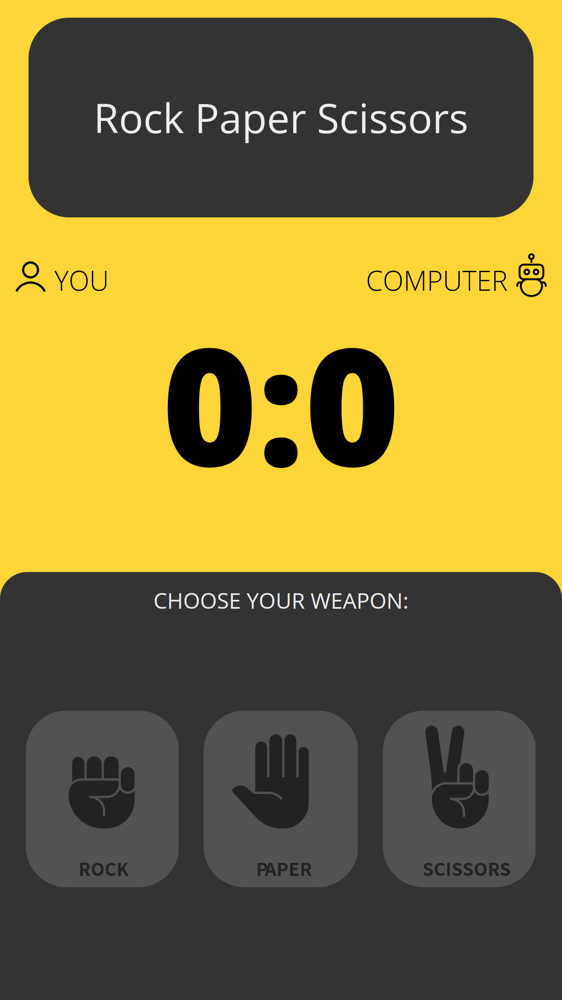

# (CURRENTLY REFACTORING) Rock Paper Scissors Web Game

A simple webpage that let users play rock-paper-scissors against the computer.

**Link To Demo**: Currently on refactoring stage

## Description

A simple beginner webpage that uses HTML, CSS, and Javascript. It runs a game of rock paper scrissors against a simple computer random AI. It is also made to be responsive to cater all devices so that all users can play no matter what device is used.

### Mobile Display

### Things that I learned

- Learned some concepts about classes and modules.
- Simple refactoring

### Things TODO

- Refactor in the future
- Refactor for a more simpler and understandable structure

## Development

1. Clone the project  
   `git clone https://github.com/re-nanashi/rock-paper-scissors.git`

2. Go the directory and run through live server

## Authors

John Reymar I. Fabro(Me)
[@juanfab.af](https://www.instagram.com/juanfab.af/)

## Acknowledgments

Design inspiration, icons, etc.

- [UX/UI - Cyber Robot](https://dribbble.com/shots/6013675-Cyber-Robot-Game-UX-UI/attachments/6013675-Cyber-Robot-Game-UX-UI?mode=media)
- [Flat Icon](https://www.flaticon.com/)
